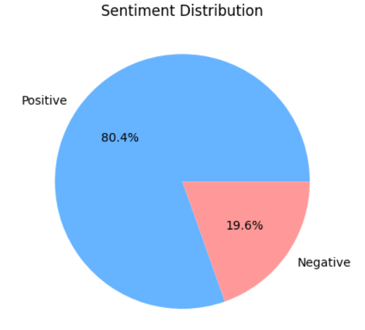
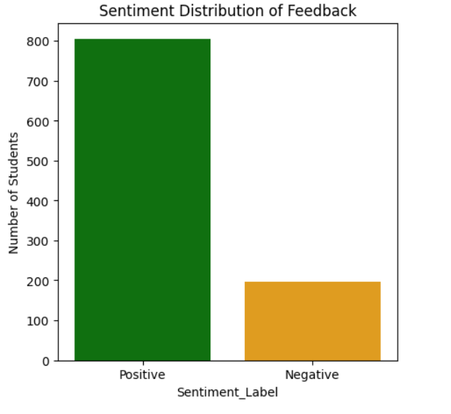
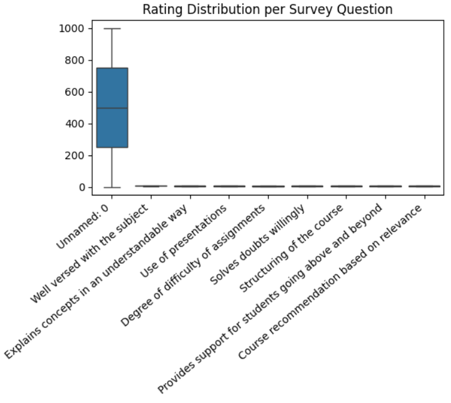
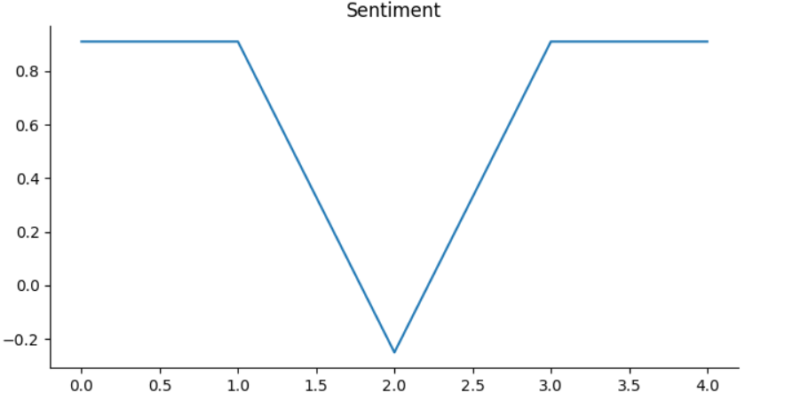
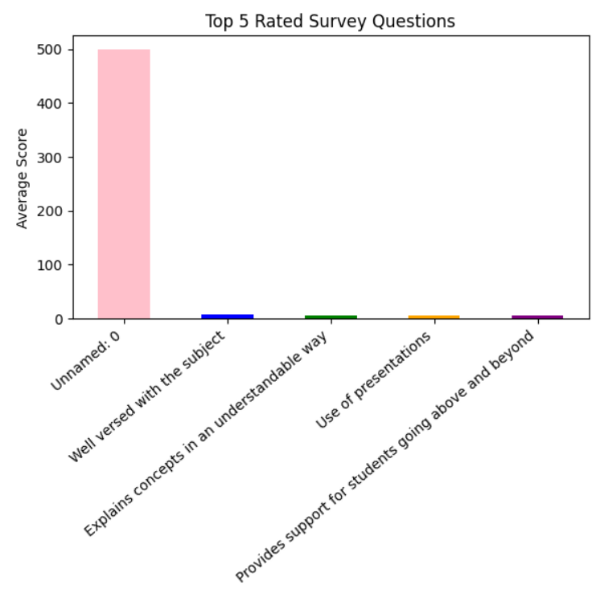

#  College Event Feedback Analysis Using Sentiment Analysis

##  Project Overview

This project analyzes student feedback collected after a college event using Python. The feedback is processed using sentiment analysis to classify responses as Positive or Negative. The project also includes exploratory data analysis (EDA) and visualizations to understand participant satisfaction and identify areas for improvement.

---

##  Objectives

- Analyze student feedback collected through survey responses.
- Perform data cleaning and preprocessing.
- Apply sentiment analysis to classify feedback.
- Visualize sentiment distribution using different charts.
- Generate insights to help improve future college events.

---

##  Tools & Technologies

- Python
- Google Colab/Jupyter Notebook
- Pandas
- NumPy
- Matplotlib
- Seaborn
- TextBlob (Sentiment Analysis)

---

##  Dataset

The dataset contains student responses for various event evaluation criteria, including:

- Student ID
- Subject Knowledge
- Explanation Clarity
- Presentation Skills
- Assignment Difficulty
- Doubt Clarification
- Course Structure
- Student Support
- Course Recommendation
- Feedback Comments
- Sentiment Score
- Sentiment Label

---

##  Project Workflow

1. Import required Python libraries.
2. Load the feedback dataset.
3. Clean and preprocess the data.
4. Perform sentiment analysis on feedback comments.
5. Create sentiment scores and sentiment labels.
6. Visualize the results using charts.
7. Analyze survey ratings and generate insights.

---

##  Key Findings

- Approximately **80%** of the feedback was classified as **Positive**.
- Around **20%** of the feedback was classified as **Negative**.
- Most students expressed satisfaction with the event and course delivery.
- A small percentage of responses highlighted areas requiring improvement.
- Data visualizations clearly show overall sentiment distribution and survey rating patterns.

---

## Visualizations

The project includes:

- ✔️ Sentiment Distribution Pie Chart
- ✔️ Sentiment Count Bar Chart
- ✔️ Rating Distribution Box Plot
- ✔️ Sentiment Analysis 
- ✔️ Survey Data Analysis

---

## 📸 Project Screenshots

### Sentiment Distribution (Pie Chart)

### Sentiment Distribution of Feedback (Bar Chart)

### Rating Distribution

### Sentiment

### Top 5 Rated Survey Questions

---

##  Future Enhancements

- Build an interactive Power BI dashboard for event feedback.
- Develop a machine learning model for sentiment prediction.
- Analyze feedback trends across multiple college events.
- Create a web application for real-time feedback analysis.
- Generate automated reports for event organizers.
